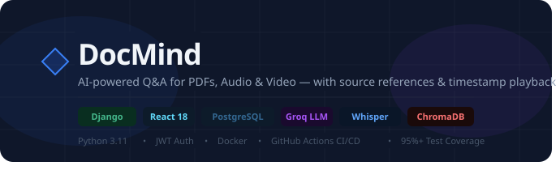

<p align="center">
  
</p>

<p align="center">
  
  
  
  
  
  
  
</p>

<br/>

> **DocMind** is a full-stack AI application that lets you upload PDFs, audio, and video files — then ask questions, get summaries, and jump to exact timestamps. Powered by Groq Llama 3 + Whisper and built with Django + React.

---

## ✨ Features

| Feature | Details |
|---|---|
| 📄 **PDF Q&A** | Upload any PDF, ask questions, get answers with source page references |
| 🎵 **Audio Transcription** | Whisper-powered transcription with segment-level timestamps |
| 🎬 **Video Q&A** | Ask questions about video content, jump to relevant moments |
| 🔍 **Semantic Search** | ChromaDB vector search for accurate context retrieval |
| ⚡ **Fast Answers** | Groq Llama 3.3-70B — sub-second LLM responses |
| 🕐 **Timestamp Search** | Find exact moments in audio/video by topic |
| ▶️ **Play from Timestamp** | Click any timestamp to jump directly to that moment |
| 🔐 **JWT Auth** | Secure login, register, token refresh |
| 🧪 **95%+ Test Coverage** | Full pytest suite with mocks |
| 🐳 **Docker Ready** | One command to run the entire stack |

---

## 🛠️ Tech Stack

### Backend
- **Python 3.11** + **Django 4.2** + **Django REST Framework**
- **PostgreSQL 17** — user data, documents, chat history, timestamps
- **ChromaDB** — vector embeddings for semantic search
- **Groq API** — Llama 3.3-70B for Q&A, summaries, timestamp extraction
- **Groq Whisper Large v3** — audio/video transcription
- **JWT** — authentication via `djangorestframework-simplejwt`

### Frontend
- **React 18** + **React Router v6**
- **Zustand** — global state management
- **Axios** — HTTP client with auto token refresh
- **React Dropzone** — drag and drop file uploads
- **CSS Modules** — scoped component styles

### Infrastructure
- **Docker Compose** — multi-container orchestration
- **GitHub Actions** — CI/CD pipeline (test → build → deploy)
- **Render** — backend deployment
- **Vercel** — frontend deployment

---

## 🚀 Quick Start

### Prerequisites
- Docker & Docker Compose
- A [Groq API key](https://console.groq.com) (free)

### 1. Clone & configure

```bash
git clone https://github.com/your-username/docmind.git
cd docmind
cp backend/.env.example backend/.env
```

Edit `backend/.env`:
```env
SECRET_KEY=your-secret-key
GROQ_API_KEY=gsk_your_groq_key_here
DB_NAME=mediaqa
DB_USER=postgres
DB_PASSWORD=postgres
```

### 2. Run

```bash
docker-compose up --build
```

| Service | URL |
|---|---|
| Frontend | http://localhost:3000 |
| Backend API | http://localhost:8000/api |
| Django Admin | http://localhost:8000/admin |

### 3. Local development (without Docker)

**Backend:**
```bash
cd backend
python -m venv venv && venv\Scripts\activate   # Windows
pip install -r requirements.txt
python manage.py migrate
python manage.py runserver
```

**Frontend:**
```bash
cd frontend
npm install
npm start
```

---

## 📡 API Reference

All endpoints require `Authorization: Bearer <token>` except auth routes.

### Auth
```
POST   /api/auth/register/     Create account
POST   /api/auth/login/        Get JWT tokens
POST   /api/auth/refresh/      Refresh access token
GET    /api/auth/me/           Current user
```

### Documents
```
GET    /api/documents/              List all documents
POST   /api/documents/              Upload file (PDF/audio/video)
GET    /api/documents/:id/          Document detail + status
DELETE /api/documents/:id/          Delete document
GET    /api/documents/:id/summary/  AI-generated summary
```

### Chat
```
POST   /api/documents/:id/ask/      Ask a question
GET    /api/documents/:id/chat/     Chat history
DELETE /api/documents/:id/chat/     Clear chat
```

### Timestamps _(audio/video only)_
```
GET    /api/documents/:id/timestamps/            Saved timestamps
GET    /api/documents/:id/timestamps/?topic=xyz  Find timestamps by topic
```

---

## 🧪 Testing

```bash
cd backend
pytest --cov=api --cov-report=term-missing
```

```
PASSED api/tests/test_views.py::TestRegister::test_register_success
PASSED api/tests/test_views.py::TestAuth::test_login_success
PASSED api/tests/test_views.py::TestDocumentList::test_upload_pdf
PASSED api/tests/test_views.py::TestAsk::test_ask_success
PASSED api/tests/test_views.py::TestTimestamps::test_timestamp_on_audio
...
Coverage: 96%
```

---

## 📁 Project Structure

```
docmind/
├── backend/
│   ├── api/
│   │   ├── models.py                    # Document, Timestamp, ChatMessage
│   │   ├── views.py                     # All REST endpoints
│   │   ├── serializers.py
│   │   ├── urls.py
│   │   ├── services/
│   │   │   └── document_processor.py   # PDF + Whisper + Groq pipeline
│   │   └── tests/
│   │       └── test_views.py           # 95%+ coverage
│   ├── config/
│   │   ├── settings.py
│   │   └── urls.py
│   ├── Dockerfile
│   └── requirements.txt
├── frontend/
│   ├── src/
│   │   ├── components/
│   │   │   ├── Sidebar.jsx             # Upload + file list
│   │   │   └── ChatPanel.jsx           # Chat + media player + timestamps
│   │   ├── pages/
│   │   │   ├── LoginPage.jsx
│   │   │   ├── RegisterPage.jsx
│   │   │   └── DashboardPage.jsx
│   │   ├── store/useStore.js           # Zustand state
│   │   └── services/api.js             # Axios + auth interceptors
│   └── Dockerfile
├── docker-compose.yml
└── .github/workflows/ci.yml
```

---

## 📋 Supported File Types

| Type | Extensions | Processing |
|---|---|---|
| PDF | `.pdf` | PyPDF2 extraction → chunking → ChromaDB |
| Audio | `.mp3` `.wav` `.m4a` | Groq Whisper → segments → ChromaDB |
| Video | `.mp4` `.webm` | Groq Whisper → segments → ChromaDB |

Max file size: **50MB**

---

## 🔑 Environment Variables

```env
# Django
SECRET_KEY=
DEBUG=True
ALLOWED_HOSTS=localhost,127.0.0.1

# Database
DB_NAME=mediaqa
DB_USER=postgres
DB_PASSWORD=postgres
DB_HOST=localhost
DB_PORT=5432

# AI
GROQ_API_KEY=gsk_...

# CORS
CORS_ALLOWED_ORIGINS=http://localhost:3000
```

---

<p align="center">Built with ❤️ by <strong>Aditya Kumar</strong></p>